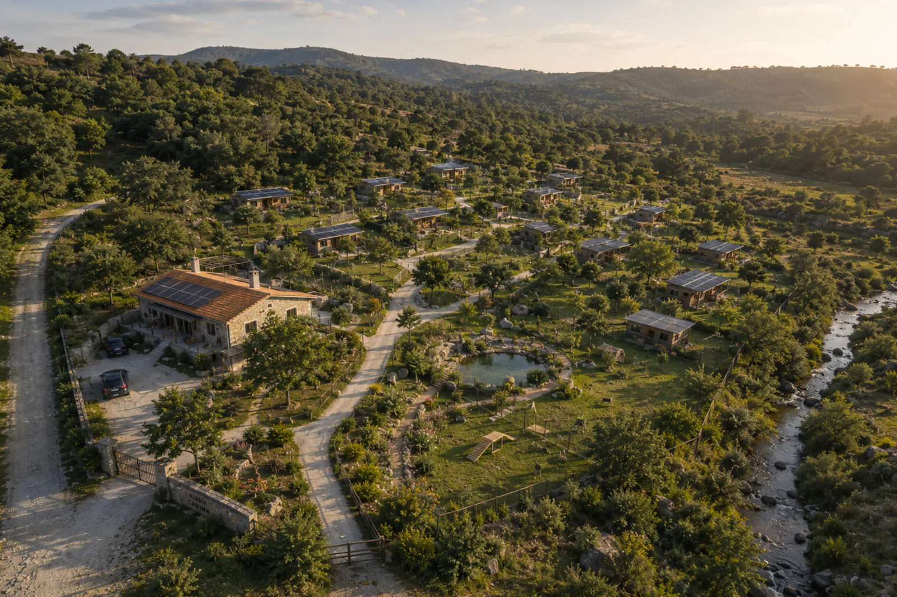
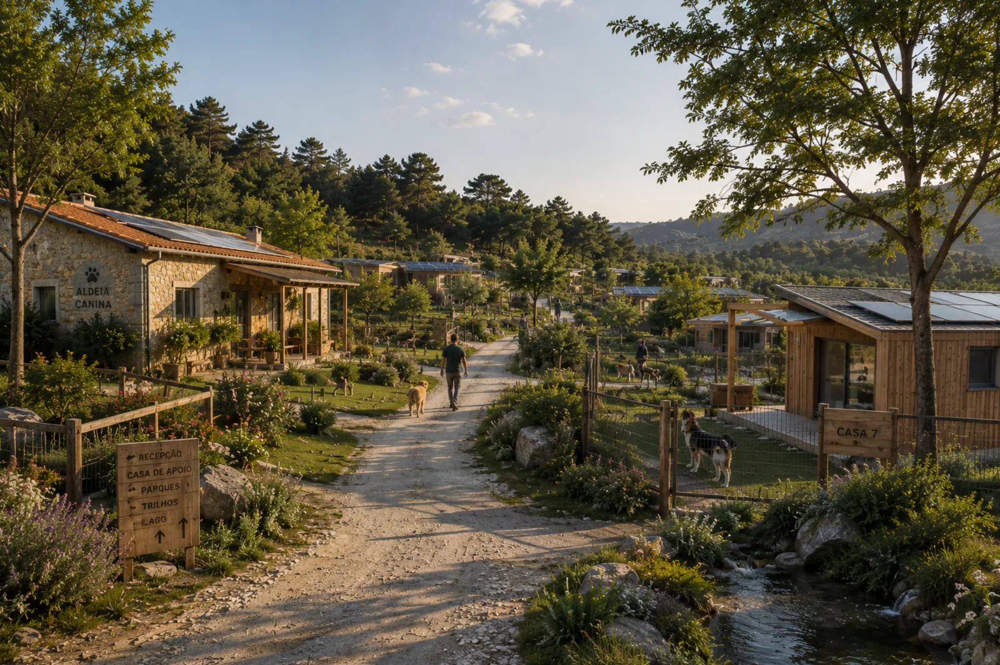

# Aldeia Canina Sustentável em Viseu

**Versão:** 1.5 
**Data:** agosto de 2026 
**Objetivo:** apresentar a visão, conceito, componentes diferenciadoras e preocupações principais de uma aldeia canina sustentável em Viseu, para análise e desenvolvimento por gabinete de projetos.

## Mapa

- [Visão](#visão)
    - [Enquadramento geral](#enquadramento-geral)
    - [Conceito-base do projeto](#conceito-base-do-projeto)
- [Pontos fortes principais do projeto](#pontos-fortes-principais-do-projeto)
    - [Conceito de aldeia canina](#conceito-de-aldeia-canina)
    - [Terreno amplo e em vale](#terreno-amplo-e-em-vale)
    - [Tratamento diferenciado por perfil do animal](#tratamento-diferenciado-por-perfil-do-animal)
    - [Zona sénior e zona calma](#zona-sénior-e-zona-calma)
    - [Atividades e enriquecimento ambiental](#atividades-e-enriquecimento-ambiental)
    - [Creche diária / ATL canino](#creche-diária--atl-canino)
    - [Sustentabilidade ambiental](#sustentabilidade-ambiental)
    - [Mobilidade animal inclusiva](#mobilidade-animal-inclusiva)
    - [Portal digital do tutor](#portal-digital-do-tutor)
    - [Imagens, vídeos e confiança dos tutores](#imagens-vídeos-e-confiança-dos-tutores)
    - [Lago raso naturalizado e zona aquática controlada](#lago-raso-naturalizado-e-zona-aquática-controlada)
- [Objetivo estratégico da candidatura](#objetivo-estratégico-da-candidatura)
- [Espaço](#espaço)
    - [Casa de Apoio Operacional e Receção](#casa-de-apoio-operacional-e-receção)
    - [Aldeia canina e casas de alojamento animal](#aldeia-canina-e-casas-de-alojamento-animal)
    - [Parques exteriores por perfil](#parques-exteriores-por-perfil)
    - [Trilhos sensoriais](#trilhos-sensoriais)
    - [Creche diária / ATL canino](#creche-diária--atl-canino-1)
    - [Zona aquática/lago naturalizado](#zona-aquáticalago-naturalizado)
    - [Enfermaria e zona de isolamento/quarentena](#enfermaria-e-zona-de-isolamentoquarentena)
    - [Grooming](#grooming)
    - [Treino e educação canina](#treino-e-educação-canina)
    - [Gatil](#gatil)
- [Sustentabilidade](#sustentabilidade)
    - [Energia](#energia)
    - [Água](#água)
    - [Solo e drenagem](#solo-e-drenagem)
    - [Materiais](#materiais)
    - [Resíduos](#resíduos)
- [Cuidados e Bem-estar](#cuidados-e-bem-estar)
    - [Avaliação inicial](#avaliação-inicial)
    - [Separação por perfil](#separação-por-perfil)
    - [Rotinas adaptadas](#rotinas-adaptadas)
    - [Programa “Primeira Estadia Sem Stress”](#programa-primeira-estadia-sem-stress)
    - [Programa “Cão Sénior”](#programa-cão-sénior)
- [Sociedade](#sociedade)
    - [Portal digital e política de imagens](#portal-digital-e-política-de-imagens)
    - [Mobilidade animal](#mobilidade-animal)
    - [Impacto social e territorial](#impacto-social-e-territorial)
- [Decisões](#decisões)
    - [Modelo de negócio](#modelo-de-negócio)
    - [Lista final de prioridades](#lista-final-de-prioridades)
    - [Riscos e mitigação](#riscos-e-mitigação)
    - [Indicadores para candidatura](#indicadores-para-candidatura)
    - [Elementos que poderão alimentar a memória descritiva](#elementos-que-poderão-alimentar-a-memória-descritiva)
    - [Recomendações finais](#recomendações-finais)

---

## Visão

### Enquadramento geral

Este documento organiza uma proposta de criação de uma **aldeia canina sustentável em Viseu**, a implantar num terreno amplo, preferencialmente em formato de vale/covão, tendo como referência preliminar uma área total igual ou superior a **20.000 m²**.

Este valor constitui um pressuposto funcional do conceito, e não uma exigência legal nem uma dimensão definitivamente fixada. A área necessária deverá ser confirmada em função da capacidade prevista, área efetivamente utilizável, topografia, acessos, drenagem, segurança, condicionantes territoriais e possibilidade de expansão.

A ideia principal é afastar o projeto do conceito tradicional de “canil” ou “hotel com boxes” e posicioná-lo como um equipamento diferenciado de:

- alojamento animal de qualidade;
- creche diária / ATL canino;
- bem-estar animal individualizado;
- sustentabilidade ambiental;
- reabilitação responsável das ruínas existentes como casa de apoio operacional;
- educação canina;
- mobilidade inclusiva;
- digitalização da relação com os tutores;
- dinamização económica e social do território.

A narrativa central deve ser:

> Criar uma aldeia canina sustentável, integrada na natureza, com casas de alojamento independentes, uma casa de apoio operacional resultante da reabilitação responsável das ruínas existentes, creche diária / ATL canino, programas adaptados ao perfil de cada animal, soluções ambientais eficientes, transporte próprio e serviços complementares de treino, grooming, socialização e educação de tutores.

_Figura 1 — Visualização conceptual da organização geral da Aldeia Canina. Não representa uma implantação ou projeto de execução definitivo._

---

### Conceito-base do projeto

#### Posicionamento recomendado

Em vez de apresentar o projeto como “um hotel canino”, devemos apresentá-lo como:

> Uma infraestrutura inovadora de alojamento, creche diária, bem-estar e educação animal, organizada como uma aldeia canina modular, sustentável e integrada num terreno natural de grande dimensão, com impacto positivo no território, criação de emprego, serviços complementares e soluções ambientais responsáveis.

---

## Pontos fortes principais do projeto

### Conceito de aldeia canina

A organização em pequenas casas de alojamento animal permite criar uma experiência muito diferenciadora face aos hotéis caninos tradicionais.

Apesar de o projeto poder incluir a função de hotel, o objetivo conceptual não é criar apenas mais um hotel canino com boxes repetidas e um padrão único de alojamento. A ideia central é criar uma verdadeira **aldeia canina**, com pequenas casas independentes de diferentes dimensões, distribuídas por zonas distintas do terreno e adaptadas ao porte, perfil, rotina e necessidades dos animais.

As unidades não devem ser entendidas como uma sucessão de boxes ou canis tradicionais. Cada unidade deve assumir a forma de uma pequena casa de alojamento, integrada na paisagem e concebida para proporcionar proteção, repouso, conforto ambiental e separação adequada entre animais. No interior poderão existir um ou mais quartos de alojamento, consoante a tipologia, mantendo sempre uma organização que preserve o bem-estar, a privacidade e a segurança dos animais.

#### Tipologias e distribuição no espaço

- casas pequenas para cães pequenos, cães calmos ou estadias individuais;
- casas médias para cães de maior porte ou cães que precisam de mais espaço;
- casas familiares para 2, 3 ou 4 cães da mesma família;
- casas em zonas mais tranquilas para cães sénior, ansiosos ou sensíveis;
- casas mais afastadas para cães que não toleram bem proximidade constante;
- organização em núcleos ou pequenas ruas, reforçando a imagem de aldeia;
- possibilidade de colocar as unidades em diferentes cotas ou zonas do vale, respeitando topografia, ruído, sombra, acessos e drenagem.

#### Características recomendadas

- unidades independentes;
- diferentes dimensões e configurações de casas;
- um ou mais quartos de alojamento no interior, de acordo com a tipologia;
- acesso direto de cada quarto a um espaço exterior privado e vedado;
- isolamento térmico e soluções de atenuação acústica;
- ventilação, iluminação natural controlada e conforto ambiental;
- água, eletricidade, drenagem e encaminhamento adequado de águas residuais;
- possibilidade de produção solar, quando técnica e operacionalmente viável;
- integração paisagística;
- caminhos entre unidades;
- afastamento entre zonas calmas e zonas mais ativas;
- identificação clara de cada unidade;
- crescimento modular e progressivo.

#### Possíveis utilizações

- alojamento individual;
- alojamento de cães da mesma família;
- alojamento de cães sénior;
- alojamento de cães ansiosos ou sensíveis;
- alojamento de cães com menor tolerância a grupos;
- estadias curtas, médias ou prolongadas;
- adaptação progressiva antes de uma primeira estadia completa.

#### Recomendações técnicas e operacionais

- desenhar o layout das casas com base na topografia, drenagem, orientação solar, ruído e acessos;
- prever zonas diferenciadas por perfil comportamental e não apenas por dimensão física;
- garantir acessos seguros para equipa, tutores, transporte, manutenção e emergência;
- evitar uma implantação demasiado densa que faça a aldeia parecer um conjunto de boxes;
- validar dimensões, materiais, ventilação, isolamento térmico, desempenho acústico, drenagem, saneamento e higienização com equipa técnica e médico veterinário responsável;
- prever soluções de expansão que não comprometam o funcionamento da zona já existente.

#### Cuidados específicos

O conceito de aldeia deve ser real no desenho e na experiência, não apenas no nome. Se todas as unidades forem iguais, demasiado próximas ou organizadas como um canil tradicional, perde-se uma parte importante da diferenciação.

Também deve evitar-se que a diversidade de casas complique demasiado a operação. A variedade deve servir o bem-estar animal e a gestão do espaço, mantendo regras claras de limpeza, circulação, segurança e lotação.

### Terreno amplo e em vale

Um terreno com uma área de referência igual ou superior a 20.000 m² poderá permitir uma implantação menos densa, com separação entre núcleos, zonas de atividade e descanso, percursos, áreas verdes e infraestruturas operacionais. A suficiência da área deverá ser confirmada através de estudo prévio de implantação.

#### Potencialidades do terreno

- caminhos internos tipo aldeia;
- zonas verdes;
- trilhos sensoriais;
- parques por perfil;
- áreas de descanso;
- zona aquática/lago naturalizado;
- áreas de sombra;
- integração com vegetação autóctone;
- afastamento entre zonas ruidosas e zonas calmas.

#### Características recomendadas

- uso da forma natural do vale para separar zonas funcionais;
- zonas altas e secas para unidades de alojamento;
- zonas mais baixas tratadas com especial atenção à drenagem;
- caminhos estabilizados e seguros;
- áreas de sombra natural e artificial;
- barreiras vegetais para conforto visual, ruído e vento;
- integração paisagística com espécies adequadas ao local.

#### Possíveis utilizações

- alojamento distribuído em pequenos núcleos;
- trilhos de passeio e exploração;
- zonas de socialização controlada;
- parques por perfil;
- áreas de descanso;
- espaços para aulas, workshops e eventos;
- zona aquática controlada, se viável.

#### Recomendações técnicas e operacionais

- realizar levantamento topográfico;
- estudar escorrências, linhas de água, zonas húmidas e pontos de acumulação;
- avaliar acessos normais e acessos de emergência;
- planear a circulação de animais, equipa, tutores, viaturas e manutenção;
- prever zonas de retenção, pavimentos permeáveis e caminhos antiderrapantes;
- validar condicionantes de PDM, REN, RAN, linhas de água e servidões.

#### Cuidados específicos

O facto de o terreno ser em vale é uma vantagem visual e conceptual, mas também pode ser um risco técnico. Drenagem, lama, cheias pontuais, erosão, acessos e incêndio devem ser avaliados antes de fechar qualquer implantação.

O layout deve respeitar o terreno em vez de tentar contrariá-lo com uma solução demasiado artificial ou dispendiosa.

### Tratamento diferenciado por perfil do animal

Este ponto deve ser destacado logo no início da candidatura.

O projeto não deve alojar todos os cães da mesma forma. Deve prever respostas diferentes para animais com necessidades diferentes.

#### Perfis a considerar

- cães sénior;
- cães ansiosos;
- cães reativos;
- cães tímidos;
- cães em primeira estadia;
- cães com medicação;
- cães com limitações físicas;
- cães com menor tolerância a grupos;
- cães muito ativos;
- cães pequenos;
- cães grandes;
- cães da mesma família.

#### Características recomendadas

- ficha individual de cada animal;
- avaliação prévia antes da admissão;
- separação por porte, energia, sociabilidade e necessidades especiais;
- rotinas adaptadas;
- possibilidade de atividades individuais;
- equipas treinadas para leitura comportamental básica;
- articulação com médico veterinário responsável.

#### Possíveis utilizações

- escolha da casa e do quarto de alojamento mais adequados;
- definição de parques compatíveis;
- integração em creche/ATL;
- preparação de primeira estadia;
- gestão de alimentação, medicação e descanso;
- identificação de cães que devem evitar grupos;
- criação de programas específicos para cães sénior, ansiosos ou reativos.

#### Recomendações técnicas e operacionais

- criar uma ficha de admissão clara e obrigatória;
- recolher informação de comportamento com pessoas, cães, ruídos, comida, manipulação e separação do tutor;
- exigir informação vacinal e sanitária adequada;
- definir critérios de aceitação, recusa ou aceitação condicionada;
- manter registos de incidentes, alterações de comportamento e observações da equipa;
- rever o perfil do cão ao longo do tempo, porque o comportamento pode variar com idade, saúde e experiência.

#### Cuidados específicos

Separar por perfil não deve ser uma promessa vaga. É preciso ter regras, espaço, equipa e rotinas para o conseguir fazer de forma segura.

Também é importante evitar rotular permanentemente um cão. Um animal pode ser ansioso numa primeira estadia e adaptar-se melhor depois, ou pode mudar de comportamento conforme saúde, idade, ambiente e experiências anteriores.

Esta abordagem permite apresentar o projeto como uma solução de **bem-estar animal individualizado**, e não apenas como alojamento temporário.

### Zona sénior e zona calma

Deve existir uma área mais tranquila para cães idosos, sensíveis ou com necessidades especiais.

#### Perfis beneficiados

- cães idosos;
- cães com menor mobilidade;
- cães em medicação;
- cães que precisam de descanso prolongado;
- cães ansiosos;
- cães sensíveis a ruído;
- cães em primeira estadia;
- cães pequenos ou frágeis.

#### Características recomendadas

- afastamento das zonas de maior ruído;
- menor estímulo visual;
- pavimento confortável e antiderrapante;
- rotinas previsíveis;
- acompanhamento mais próximo;
- possibilidade de gestão de medicação;
- passeios curtos e adaptados;
- zonas de descanso com sombra;
- relatórios específicos para tutores.

#### Possíveis utilizações

- estadias sénior;
- estadias de recuperação leve, sem substituir cuidados veterinários;
- alojamento de cães sensíveis;
- períodos de descanso durante creche/ATL;
- adaptação progressiva de cães em primeira experiência;
- acompanhamento de animais com rotinas muito previsíveis.

#### Recomendações técnicas e operacionais

- escolher uma zona com baixo ruído e boa sombra;
- prever pavimentos confortáveis e fáceis de limpar;
- limitar estímulos visuais entre cães;
- garantir acesso rápido da equipa;
- criar rotinas estáveis de alimentação, passeio e descanso;
- definir procedimentos para medicação, observação e comunicação com tutores.

#### Cuidados específicos

Esta zona não deve ser apresentada como enfermaria ou substituto de hospitalização veterinária. Deve ser uma zona de bem-estar e acompanhamento adaptado, com limites claros e articulação com médico veterinário quando necessário.

Também deve evitar-se misturar cães sénior frágeis com cães demasiado ativos, mesmo que sejam sociáveis.

Esta zona pode ser uma das maiores diferenciações comerciais e técnicas do projeto.

### Atividades e enriquecimento ambiental

O projeto deve destacar que os animais não ficam apenas alojados. Têm atividades adaptadas, enriquecimento ambiental e estímulos saudáveis.

#### Atividades possíveis

- trilhos sensoriais;
- percursos de faro;
- zonas com diferentes texturas;
- jogos cognitivos;
- zonas de escavação controlada;
- pequenas pontes;
- túneis baixos;
- plataformas de equilíbrio;
- agility leve;
- zonas de relaxamento;
- passeios orientados;
- brincadeiras por grupo de compatibilidade;
- atividades individuais para cães que não convivem bem com outros.

#### Características recomendadas

- atividades ajustadas ao perfil do cão;
- alternância entre estímulo e descanso;
- materiais seguros, laváveis e resistentes;
- zonas com diferentes texturas e cheiros;
- opções para atividades individuais e de grupo;
- supervisão da equipa;
- registo de preferências e limitações de cada animal.

#### Possíveis utilizações

- redução de stress;
- gasto físico saudável;
- estimulação mental;
- apoio à adaptação em estadias;
- complemento da creche/ATL;
- sessões de treino leve;
- experiências diferenciadoras para comunicação com tutores.

#### Recomendações técnicas e operacionais

- definir atividades por idade, porte, energia e condição física;
- evitar excesso de estímulo em cães ansiosos ou reativos;
- criar horários de utilização dos espaços;
- alternar grupos para reduzir conflitos;
- inspecionar regularmente túneis, rampas, plataformas e materiais;
- garantir que plantas, substratos e equipamentos são seguros para cães.

#### Cuidados específicos

Enriquecimento ambiental não significa manter os cães sempre ativos. Descanso, previsibilidade e pausas são tão importantes como brincadeira e exercício.

As atividades devem ser supervisionadas e adaptadas. O mesmo exercício pode ser positivo para um cão jovem e inadequado para um cão sénior, braquicefálico, ansioso ou com limitações físicas.

O objetivo é comunicar que o projeto promove exercício físico, estimulação mental e redução de stress.

### Creche diária / ATL canino

Para além das estadias com dormida, o projeto deve assumir explicitamente uma componente de **creche diária / ATL canino**.

Este serviço permite apoiar tutores que precisam de deixar o cão durante o dia, sem necessidade de alojamento noturno, e transforma o espaço numa resposta mais completa, regular e próxima da comunidade.

#### Modalidades de utilização

- dia completo;
- meio dia;
- dias pontuais;
- pacotes semanais ou mensais;
- integração com transporte;
- integração com grooming;
- integração com treino.

#### Características recomendadas

- avaliação prévia;
- lotação diária controlada;
- grupos compatíveis;
- zonas de atividade;
- zonas de descanso;
- horários de entrada e saída;
- comunicação simples com tutores.

#### Possíveis utilizações

- apoio a tutores com horários de trabalho longos;
- ocupação saudável para cães jovens, ativos ou com necessidade de estímulo;
- dias pontuais de acompanhamento quando o tutor não consegue estar presente;
- integração progressiva antes de uma primeira estadia no hotel;
- socialização controlada com outros cães compatíveis;
- complemento a serviços de treino, grooming ou transporte.

#### Recomendações técnicas e operacionais

- definir critérios de admissão específicos para creche/ATL;
- criar horários de entrada, saída, descanso, atividade e alimentação;
- limitar o número diário de cães por equipa disponível;
- separar grupos por porte, energia, sociabilidade e estilo de brincadeira;
- prever zonas de pausa para evitar excesso de excitação;
- manter registos de adaptação, incidentes e compatibilidades;
- articular a creche/ATL com reservas, transporte, grooming e treino.

#### Cuidados específicos

A creche/ATL deve funcionar com avaliação prévia, grupos controlados, separação por porte e perfil comportamental, períodos de descanso e lotação diária adequada à equipa disponível.

Nem todos os cães são bons candidatos a creche em grupo. Deve existir a possibilidade de atividades individuais, adaptação gradual ou recusa fundamentada quando a segurança ou o bem-estar do animal ou do grupo possam estar em causa.

### Sustentabilidade ambiental

A sustentabilidade ambiental deve ser tratada como uma parte estrutural do projeto e não apenas como elemento decorativo. O terreno amplo, a exposição solar, a necessidade de água, a drenagem do vale e a utilização diária das instalações tornam este ponto especialmente relevante.

#### Áreas de intervenção ambiental

- reabilitação e reutilização das ruínas existentes;
- painéis solares;
- eventual micro-rede energética;
- baterias;
- iluminação LED;
- sensores de presença;
- recolha de águas pluviais;
- pavimentos permeáveis;
- drenagem natural;
- vegetação autóctone;
- materiais sustentáveis;
- redução de plásticos;
- gestão responsável de resíduos;
- mobilidade elétrica ou híbrida.

#### Características recomendadas

- aproveitamento do edificado existente sempre que a sua estabilidade e adequação funcional sejam confirmadas;
- soluções energéticas proporcionais ao consumo previsto;
- recolha e armazenamento de águas pluviais;
- pavimentos permeáveis;
- espécies autóctones;
- materiais duráveis e de baixa manutenção;
- iluminação eficiente;
- monitorização de consumos.

#### Possíveis utilizações

- alimentação parcial de energia das casas de alojamento e da casa de apoio;
- iluminação exterior eficiente;
- apoio a equipamentos técnicos;
- rega de zonas verdes com água recolhida, quando legalmente permitido;
- redução de consumo de água potável em usos adequados;
- comunicação ambiental do projeto;
- eventual carregamento de viatura elétrica ou híbrida.

#### Recomendações técnicas e operacionais

- avaliar estruturalmente as ruínas e confirmar o seu enquadramento urbanístico antes de definir a intervenção;
- dimensionar energia solar com base em consumos reais previstos;
- estudar baterias apenas quando fizer sentido técnico e financeiro;
- planear drenagem e água em conjunto, sobretudo por se tratar de um vale;
- escolher materiais resistentes à humidade, limpeza e uso intensivo;
- definir plano de resíduos, higienização e redução de descartáveis;
- validar soluções ambientais elegíveis para financiamento.

#### Cuidados específicos

A sustentabilidade deve ser apresentada com ambição, mas sem prometer autonomia total antes de haver estudo técnico. A reabilitação das ruínas e a instalação de painéis solares nas casas de alojamento podem ser elementos fortes, mas as soluções finais devem depender da estabilidade do edificado, orientação, sombreamento, custo, manutenção e segurança.

Também é importante evitar soluções “verdes” que depois sejam difíceis de limpar, manter ou licenciar.

### Mobilidade animal inclusiva

A ideia do mini autocarro/carrinha é muito forte.

Deve ser apresentada como:

> Serviço de mobilidade animal que reduz barreiras de acesso ao hotel, apoiando tutores sem transporte próprio, pessoas idosas, famílias com horários difíceis e clientes que vivem em zonas afastadas.

#### Serviços associados

- recolha e entrega para estadias;
- recolha e entrega para creche/ATL;
- transporte para grooming;
- transporte para aulas;
- rotas semanais;
- parcerias com veterinários;
- apoio a pessoas com dificuldade de deslocação.

#### Características recomendadas

- viatura adaptada ao transporte animal;
- transportadoras ou compartimentos seguros;
- climatização;
- ventilação;
- limpeza fácil;
- separação entre animais;
- rotas organizadas;
- registo de recolhas e entregas.

#### Possíveis utilizações

- recolha em casa do tutor;
- entrega após estadia;
- transporte para creche/ATL;
- transporte para grooming;
- transporte para aulas de treino;
- apoio a tutores idosos ou sem viatura;
- rotas em dias específicos.

#### Recomendações técnicas e operacionais

- definir regras de transporte por porte, temperamento e saúde;
- garantir que animais incompatíveis não viajam em contacto direto;
- prever kit de primeiros socorros e contactos de emergência;
- higienizar a viatura entre utilizações;
- registar autorizações de transporte;
- organizar rotas para reduzir stress e tempo de viagem;
- avaliar viatura elétrica ou híbrida se for viável.

#### Cuidados específicos

O transporte é uma mais-valia, mas também acrescenta responsabilidade operacional. Deve haver regras claras para atrasos, recolhas, entregas, documentação, animais ansiosos, enjoos, fugas, acidentes e emergências.

O serviço não deve ser apresentado como transporte livre ou improvisado, mas como uma operação controlada e registada.

### Portal digital do tutor

O portal do tutor deve ser incluído como elemento de digitalização e confiança.

#### Funcionalidades prioritárias

- ficha do animal;
- dados do tutor;
- contactos de emergência;
- boletim de vacinas;
- alimentação habitual;
- medicação;
- preferências do animal;
- autorização para recolha/transporte;
- autorizações de imagem;
- reservas de estadias, creche/ATL e serviços;
- histórico de estadias e utilizações de creche/ATL.

#### Características recomendadas

- acesso autenticado;
- dados organizados por tutor e por animal;
- permissões de visualização adequadas;
- registo de autorizações;
- histórico de serviços;
- informação sanitária atualizável;
- interface simples para a equipa.

#### Possíveis utilizações

- relatórios diários;
- fotografias;
- vídeos curtos;
- check-in/check-out digital;
- pagamentos;
- alertas;
- recomendações pós-estadia.

#### Recomendações técnicas e operacionais

- começar por funcionalidades essenciais;
- evitar recolha de dados desnecessários;
- proteger dados pessoais e informação sensível;
- prever consentimentos para imagem, transporte e comunicações;
- definir prazos de retenção e eliminação de dados;
- garantir backups e controlo de acessos;
- articular o portal com reservas, admissão e comunicação diária.

#### Cuidados específicos

O portal deve simplificar a operação, não criar trabalho duplicado. Se for demasiado complexo no arranque, pode gerar erros, baixa adesão e sobrecarga para a equipa.

Também deve ser tratado com especial cuidado por envolver dados pessoais, informação sobre animais, documentos, autorizações e imagens.

### Imagens, vídeos e confiança dos tutores

É recomendável incluir partilha de imagens, mas com prudência.

#### Modelo de comunicação visual

- fotografias e vídeos curtos selecionados pela equipa;
- acesso apenas pelo tutor do animal;
- partilha controlada através do portal ou mensagem;
- consentimento explícito para uso de imagens;
- regras diferentes para imagens privadas e redes sociais;
- evitar promessa de câmaras 24/7 no arranque.

#### Características recomendadas

- captação controlada pela equipa;
- partilha privada;
- autorização explícita do tutor;
- separação entre imagens privadas e imagens promocionais;
- seleção de imagens que respeitem o bem-estar do animal;
- armazenamento limitado;
- registo de consentimentos.

#### Possíveis utilizações

- tranquilizar tutores durante estadias;
- mostrar adaptação do cão;
- partilhar momentos de atividade ou descanso;
- apoiar relatórios diários;
- comunicar eventos e atividades;
- criar material promocional apenas com autorização adequada.

#### Recomendações técnicas e operacionais

- definir política de imagem;
- recolher consentimento específico;
- evitar mostrar terceiros sem autorização;
- limitar o acesso a imagens privadas;
- definir quem pode captar, selecionar e enviar imagens;
- evitar prometer frequência diária se a equipa não conseguir cumprir;
- avaliar videovigilância separadamente da comunicação com tutores.

#### Cuidados específicos

Acesso permanente a câmaras pode trazer desafios de privacidade, RGPD, segurança, ansiedade dos tutores e gestão operacional. Por isso, deve ser apresentado como uma evolução possível, não como promessa central no arranque.

Também é importante evitar que a partilha de imagens interfira com a rotina dos animais ou com o trabalho de cuidado. A prioridade deve ser o bem-estar animal, não a produção constante de conteúdo.

### Lago raso naturalizado e zona aquática controlada

A criação de um lago raso naturalizado pode constituir um dos elementos diferenciadores do projeto, desde que seja concebido como uma infraestrutura controlada, segura e tecnicamente acompanhada.

Mais do que um elemento decorativo, esta zona aquática poderá funcionar como espaço de enriquecimento ambiental, conforto térmico e exercício supervisionado, contribuindo para uma experiência mais completa e diferenciadora para os animais.

No entanto, pela sua natureza, o lago deve ser tratado como uma componente sujeita a estudo técnico prévio, validação ambiental, eventual licenciamento e protocolos rigorosos de segurança, higiene e manutenção.

#### Potencialidades do lago

- enriquecimento ambiental através de contacto controlado com água e novos estímulos;
- exercício físico supervisionado, especialmente útil para cães ativos;
- conforto térmico em dias quentes;
- experiência diferenciadora face a hotéis caninos tradicionais;
- valorização paisagística do terreno;
- criação de uma zona visualmente atrativa para comunicação, eventos e apresentação do projeto;
- possibilidade de atividades adaptadas, como brincadeiras aquáticas leves, percursos junto à água e sessões controladas de exploração sensorial.

#### Características recomendadas

- profundidade reduzida;
- margens seguras;
- acessos antiderrapantes;
- rampas de entrada e saída;
- delimitação física;
- sombra nas zonas de espera;
- zona seca alternativa;
- integração com o plano de drenagem.

#### Possíveis utilizações

- brincadeira supervisionada;
- enriquecimento ambiental;
- conforto térmico em dias quentes;
- atividades individuais;
- atividades em pequenos grupos compatíveis;
- exploração sensorial junto à água;
- elemento paisagístico diferenciador.

#### Recomendações técnicas e operacionais

- realizar estudo técnico prévio sobre viabilidade, drenagem, impermeabilização, segurança e manutenção;
- confirmar previamente os requisitos legais, ambientais e eventuais necessidades de licenciamento;
- garantir profundidade reduzida e controlada;
- criar zonas rasas claramente delimitadas;
- instalar rampas de entrada e saída em vários pontos;
- usar materiais antiderrapantes nas zonas de acesso;
- vedar ou delimitar o lago para impedir acesso livre e não supervisionado;
- permitir acesso apenas com supervisão da equipa;
- definir regras específicas por porte, idade, condição física e perfil comportamental;
- separar grupos de animais durante a utilização;
- criar horários próprios de utilização para evitar excesso de excitação;
- implementar controlo regular da qualidade da água;
- estabelecer plano de limpeza, filtragem e manutenção;
- prevenir acumulação de algas, odores, mosquitos e águas paradas;
- criar uma zona alternativa seca para cães que não gostam de água ou não devem ter acesso ao lago;
- prever encerramento temporário da zona aquática sempre que as condições de segurança ou higiene não estejam garantidas;
- integrar o lago no plano geral de drenagem e gestão da água do vale;
- assegurar que a zona aquática não aumenta riscos de fuga, queda, lama excessiva ou contaminação cruzada entre animais.

#### Cuidados específicos

O lago não deve ser apresentado como uma zona de recreio livre ou permanente. Deve ser comunicado como uma área de acesso condicionado, supervisionado e adaptado ao perfil de cada animal.

Cães idosos, cães pequenos, cães com problemas articulares, cães ansiosos, cães braquicefálicos ou cães com limitações físicas devem ter avaliação individual antes de utilizar esta zona.

Desta forma, o lago passa a ser uma mais-valia do projeto sem comprometer a segurança, a higiene, o bem-estar animal ou a viabilidade operacional.

---

## Objetivo estratégico da candidatura

O desenvolvimento técnico e a candidatura deverão demonstrar que o projeto é:

1. **Viável** - tem modelo de negócio, evolução modular e controlo de risco.
2. **Diferenciador** - não é um hotel canino comum.
3. **Sustentável** - reduz impacto ambiental e usa recursos de forma responsável.
4. **Inovador** - usa digitalização, desenho modular e serviços personalizados.
5. **Útil ao território** - cria emprego, parcerias e dinamização local.
6. **Seguro** - tem protocolos, licenciamento e gestão profissional.
7. **Escalável** - pode evoluir de forma modular.

---

## Espaço

> **Estrutura**

### Casa de Apoio Operacional e Receção

A aldeia deverá incluir uma **Casa de Apoio Operacional**, preferencialmente instalada através da reabilitação das ruínas existentes no terreno, desde que a sua estabilidade, enquadramento urbanístico e adequação funcional sejam confirmados.

Esta intervenção poderá valorizar o património construído existente e ser analisada no contexto de eventuais programas de apoio à reabilitação. A elegibilidade para financiamento não deve ser assumida antes de serem conhecidos o programa aplicável, as condições da candidatura e o projeto técnico.

Funções:

- receção de tutores;
- check-in e check-out de estadias, creche/ATL e serviços complementares;
- validação documental;
- avaliação inicial;
- entrega/recolha dos animais;
- gabinete administrativo e espaço para reuniões;
- pequena loja de produtos, se fizer sentido.

Instalações da equipa:

- instalações sanitárias, incluindo solução acessível;
- vestiários, duche e cacifos;
- pequena copa para apoio à equipa;
- sala de repouso temporário para permanências prolongadas ou situações operacionais excecionais.

A sala de repouso constitui uma instalação de apoio à equipa. Não deve ser apresentada nem utilizada como habitação, alojamento turístico ou residência permanente.

Áreas operacionais e técnicas:

- lavandaria organizada para separar os circuitos de material sujo e limpo;
- zona de preparação de alimentação animal;
- armazém de alimentação em condições controladas, protegido de humidade, pragas e contaminação;
- armazém separado para produtos de limpeza e higienização;
- armazém independente para ferramentas, equipamentos e materiais de manutenção;
- zona para lavagem, secagem e recolha de material;
- arrumos para equipamento limpo;
- área técnica para sistemas elétricos, água, energia e monitorização;
- área controlada para separação e recolha de resíduos;
- espaço para registos operacionais.

Características:

- acesso controlado;
- dupla porta de segurança;
- zona de espera separada;
- separação entre circulação pública, áreas da equipa e circuitos operacionais;
- separação física entre alimentação, produtos de limpeza, manutenção e resíduos;
- espaço limpo e profissional;
- boa sinalética;
- fácil acesso para a carrinha/autocarro;
- acessibilidade e condições adequadas de ventilação, iluminação, saneamento e segurança contra incêndio.
- possibilidade de integração com painéis solares, quando técnica e economicamente viável.

### Aldeia canina e casas de alojamento animal

> **Papel no projeto:** O coração do projeto.

_Figura 2 — Visualização conceptual da experiência e ambiente pretendidos._

As casas de alojamento animal devem funcionar como pequenas construções independentes ou integradas em núcleos pouco densos, evitando a imagem e a experiência de uma sequência de canis convencionais. A arquitetura, os materiais, o afastamento entre unidades e a relação com a paisagem devem reforçar o conceito de aldeia.

Tipos de unidades sugeridas:

| Tipo de casa    | Utilização                  | Configuração e adaptações principais                                             |
| --------------- | --------------------------- | -------------------------------------------------------------------------------- |
| Casa S          | 1 cão pequeno/médio         | quarto protegido, exterior privado e escala adaptada                             |
| Casa M          | 1 cão grande ou 2 pequenos  | maior área interior e exterior, ventilação e circulação reforçadas               |
| Casa Família    | 2 a 4 cães da mesma família | quartos comunicantes ou área conjunta, sem contacto com animais de outra família |
| Casa Calma      | cães idosos/sensíveis       | zona silenciosa, maior atenuação acústica e pavimento confortável                |
| Casa Individual | cães que não podem conviver | barreiras visuais, acessos próprios e maior controlo operacional                 |

Cada casa poderá integrar um ou mais quartos de alojamento, dependendo da tipologia. Cada quarto deverá possuir uma área interior protegida e acesso direto a um espaço exterior privado, vedado e separado das restantes áreas da aldeia. A configuração deverá permitir que o animal alterne entre repouso, observação e permanência exterior de acordo com a sua rotina e sempre sob as condições definidas pela equipa.

Características construtivas e ambientais recomendadas:

- construção robusta, segura e integrada na paisagem;
- isolamento térmico adequado ao clima local;
- soluções de atenuação acústica entre quartos, casas e zonas funcionais;
- ventilação adequada e renovação de ar;
- iluminação natural controlada e iluminação artificial eficiente;
- pavimento confortável, antiderrapante, lavável e resistente ao uso intensivo;
- paredes, remates e materiais compatíveis com higienização frequente;
- proteção contra humidade, chuva, calor, frio e correntes de ar;
- monitorização ambiental de temperatura e humidade, quando aplicável.

Organização do alojamento:

- área interior seca, protegida e confortável;
- cama, plataforma ou zona de repouso adequada ao perfil do animal;
- água potável permanentemente disponível;
- pontos de alimentação concebidos para reduzir contaminação e competição;
- espaço exterior privado, vedado e com acesso direto a partir do quarto;
- sombra e abrigo parcial no espaço exterior;
- barreiras visuais quando o perfil comportamental do animal o exija;
- identificação clara de cada casa e quarto;
- dupla barreira ou sistema equivalente de segurança nos acessos;
- acesso operacional para limpeza, manutenção e emergência.

Infraestruturas:

- abastecimento de água e eletricidade;
- drenagem e encaminhamento adequado de águas residuais;
- ligação à rede de saneamento ou solução autónoma devidamente estudada e licenciada;
- possibilidade de produção solar local, quando técnica, económica e operacionalmente viável;
- equipamentos instalados de forma a não criar riscos de mordedura, fuga, ferimento ou acesso indevido.

Os painéis solares em cada casa constituem uma possibilidade e não uma solução obrigatória. A produção poderá ser individual, agrupada ou centralizada, consoante o estudo energético, a orientação solar, o sombreamento, a manutenção e a segurança.

#### Referência legal mínima para alojamento de cães

O [Decreto-Lei n.º 276/2001, de 17 de outubro](https://diariodarepublica.pt/dr/detalhe/decreto-lei/276-2001-626241), prevê que o alojamento de cães e gatos obedeça às dimensões mínimas indicadas no respetivo anexo III. Estes valores devem ser tratados como mínimos legais de referência e não como dimensões recomendadas para o projeto final, que deverá ser validado pelo gabinete de projetos, médico veterinário responsável e entidades competentes.

Para cães alojados individualmente:

| Unidade de detenção      | Peso vivo do cão | Superfície mínima de base | Altura mínima |
| ------------------------ | ---------------- | ------------------------- | ------------- |
| Recinto fechado          | Até 16 kg        | 2 m²                      | 180 cm        |
| Recinto fechado          | 16 a 20 kg       | 2,2 m²                    | 180 cm        |
| Recinto fechado          | 20 a 24 kg       | 3 m²                      | 180 cm        |
| Recinto fechado          | 24 a 28 kg       | 3,6 m²                    | 180 cm        |
| Recinto fechado          | 28 a 32 kg       | 4 m²                      | 180 cm        |
| Recinto fechado          | Mais de 32 kg    | Mais de 4,3 m²            | 180 cm        |
| Recinto fechado exterior | Até 24 kg        | 6 m²                      | 180 cm        |
| Recinto fechado exterior | 24 a 28 kg       | 7,2 m²                    | 180 cm        |
| Recinto fechado exterior | 28 a 32 kg       | 8 m²                      | 180 cm        |
| Recinto fechado exterior | Mais de 32 kg    | 8,6 m²                    | 180 cm        |

Para cães alojados em grupo, o anexo III prevê as seguintes superfícies mínimas de base:

| Número de cães | Unidade de detenção      | Até 16 kg | 16 a 28 kg | Mais de 28 kg |
| -------------- | ------------------------ | --------: | ---------: | ------------: |
| 2              | Recinto fechado          |    2,5 m² |     3,5 m² |        6,4 m² |
| 3              | Recinto fechado          |    3,5 m² |     4,6 m² |             - |
| 4              | Recinto fechado          |      4 m² |     5,6 m² |             - |
| 5              | Recinto fechado          |    4,7 m² |     6,5 m² |             - |
| 6              | Recinto fechado          |    5,3 m² |          - |             - |
| 7              | Recinto fechado          |    5,9 m² |          - |             - |
| 2              | Recinto fechado exterior |    7,5 m² |      10 m² |         13 m² |
| 3              | Recinto fechado exterior |     10 m² |      13 m² |         17 m² |
| 4              | Recinto fechado exterior |     12 m² |      15 m² |         20 m² |
| 5              | Recinto fechado exterior |     14 m² |      18 m² |         24 m² |
| 6              | Recinto fechado exterior |     16 m² |      20 m² |         27 m² |
| 7              | Recinto fechado exterior |   17,5 m² |      22 m² |         29 m² |
| 8              | Recinto fechado exterior |   19,5 m² |      24 m² |         32 m² |
| 9              | Recinto fechado exterior |     21 m² |      26 m² |         35 m² |
| 10             | Recinto fechado exterior |     23 m² |      28 m² |         37 m² |

As células assinaladas com "-" correspondem a situações em que a tabela legal consultada não apresenta valor específico.

O mesmo anexo indica ainda que a superfície mínima do chão do recinto para uma cadela e respetiva ninhada deve estar compreendida entre 4 m² e 6 m².

### Parques exteriores por perfil

Não deve existir apenas “um parque grande”. Devem existir áreas adaptadas.

Sugestões:

- parque para cães pequenos;
- parque para cães grandes;
- parque ativo;
- parque calmo;
- parque individual;
- parque de adaptação;
- parque para cães sénior;
- parque para aulas.

### Trilhos sensoriais

Percursos com estímulos controlados.

Elementos:

- relva;
- areia;
- madeira;
- pedra lisa;
- casca de pinheiro;
- plantas aromáticas seguras;
- pequenas rampas;
- túneis;
- plataformas;
- zonas de faro;
- pontos de pausa.

Benefícios:

- estimulação mental;
- redução de ansiedade;
- atividade física moderada;
- experiência diferenciadora;
- enriquecimento ambiental.

### Creche diária / ATL canino

A creche diária / ATL canino deve ser pensada como uma utilização diurna do espaço, sem alojamento noturno, articulada com os parques exteriores, trilhos sensoriais, zonas de descanso e avaliação comportamental.

Pode incluir:

- zona de receção e entrega rápida;
- áreas de permanência diurna;
- parques por grupo de compatibilidade;
- períodos de atividade e descanso;
- rotinas adaptadas ao perfil do cão;
- ligação a treino, grooming e transporte.

Esta componente deve ter lotação própria, regras de admissão, avaliação prévia e separação por porte, idade, energia e sociabilidade.

### Zona aquática/lago naturalizado

A ideia do lago é boa, mas deve ser tratada como infraestrutura controlada.

Formulação recomendada:

> Criação, sujeita a validação técnica e licenciamento aplicável, de uma zona aquática naturalizada e controlada, destinada a enriquecimento ambiental, exercício supervisionado e conforto térmico dos animais.

Requisitos:

- estudo técnico;
- rampas de entrada e saída;
- zonas rasas;
- vedação;
- acesso supervisionado;
- controlo de qualidade da água;
- plano de limpeza;
- separação por grupos;
- zona alternativa para cães que não gostam de água;
- regras de segurança.

### Enfermaria e zona de isolamento/quarentena

A enfermaria e a zona de isolamento/quarentena devem ser tratadas como instalações especializadas, separadas da circulação pública, da preparação de alimentos e das áreas comuns da equipa.

Devem incluir, conforme validação técnica e veterinária:

- acesso controlado e, sempre que possível, independente;
- ventilação e materiais adequados à higienização;
- condições de observação temporária de animais;
- separação física e visual das restantes casas de alojamento;
- ponto de água, drenagem e equipamentos próprios;
- armazenamento dedicado de material de utilização exclusiva;
- protocolos de entrada, saída, limpeza e gestão de resíduos;
- articulação com médico veterinário, sem substituir cuidados clínicos externos quando necessários.

### Grooming

Pode ser componente de arranque ou complementar, a validar pelo gabinete de projetos.

Serviços possíveis:

- banho;
- tosquia;
- escovagem;
- corte de unhas;
- higiene básica;
- preparação pós-estadia.

### Treino e educação canina

Serviços possíveis:

- aulas individuais;
- aulas de grupo;
- socialização de cachorros;
- obediência básica;
- treino de cães adotados;
- sessões para cães reativos;
- workshops para tutores;
- aulas para famílias com crianças.

### Gatil

O gatil deve ser separado do hotel canino.

Recomendações:

- edifício afastado do ruído dos cães;
- boa ventilação;
- luz natural;
- enriquecimento vertical;
- esconderijos;
- prateleiras;
- zonas individuais;
- controlo de odores;
- acesso controlado;
- baixa densidade.

Como não é prioridade, deve ser apresentado como possibilidade futura ou componente secundária.

---

## Sustentabilidade

> **Plano de sustentabilidade ambiental**

### Energia

Medidas:

- painéis solares;
- micro-rede energética;
- baterias;
- iluminação LED;
- sensores de presença;
- monitorização de consumos;
- carregamento para viatura elétrica/híbrida.

### Água

Medidas:

- recolha de águas pluviais;
- cisternas;
- rega gota-a-gota;
- espécies autóctones;
- pavimentos permeáveis;
- bacias de retenção;
- drenagem natural;
- redução de água potável em lavagens exteriores, quando legalmente permitido.

### Solo e drenagem

Como o terreno é em vale/covão, esta área é crítica.

Medidas:

- estudo de escoamento;
- proteção de taludes;
- caminhos estabilizados;
- valas drenantes;
- pavimentos permeáveis;
- zonas de retenção;
- controlo de lama;
- plantação de vegetação para fixação do solo.

### Materiais

Sugestões:

- madeira certificada;
- cortiça;
- materiais reciclados quando adequados;
- isolamento térmico eficiente;
- coberturas ventiladas;
- telhados verdes em zonas selecionadas;
- tintas e acabamentos de baixa toxicidade.

### Resíduos

Medidas:

- separação de resíduos;
- redução de plásticos descartáveis;
- estações de recolha de dejetos;
- produtos de limpeza adequados;
- compostagem apenas de resíduos verdes, salvo validação técnica para outras opções;
- plano de higienização.

---

## Cuidados e Bem-estar

> **Plano de bem-estar animal**

### Avaliação inicial

Antes de aceitar, alojar ou receber um animal em creche/ATL, recolher (pessoalmente ou via portal) informação detalhada sobre o perfil do cão, incluindo:

- idade;
- porte;
- raça/tipo;
- estado vacinal;
- desparasitação;
- alimentação;
- medicação;
- histórico veterinário relevante;
- tipo de serviço previsto;
- comportamento com pessoas;
- comportamento com cães;
- medos;
- rotinas;
- necessidades especiais;
- contacto veterinário habitual.

### Separação por perfil

Critérios:

- porte;
- idade;
- nível de energia;
- sociabilidade;
- ansiedade;
- reatividade;
- estado de saúde;
- experiência anterior em hotel;
- experiência anterior em creche/ATL;
- pertença à mesma família.

### Rotinas adaptadas

Cada cão pode ter um plano simples:

- alimentação;
- descanso;
- passeio;
- brincadeira;
- socialização;
- atividades de faro;
- períodos de descanso em contexto de creche/ATL;
- medicação;
- observações.

### Programa “Primeira Estadia Sem Stress”

Objetivo: reduzir ansiedade e risco de má adaptação.

Etapas:

1. Visita inicial com tutor.
2. Meio dia de adaptação.
3. Dia experimental.
4. Primeira noite, se necessário.
5. Relatório comportamental.

### Programa “Cão Sénior”

Inclui:

- zona calma;
- passeios curtos;
- pavimento confortável;
- alimentação acompanhada;
- medicação;
- descanso prolongado;
- menor exposição a grupos;
- relatório diário.

---

## Sociedade

### Portal digital e política de imagens

#### Objetivo do portal

O portal deve aumentar confiança, organização e profissionalismo.

Objetivos:

- centralizar informação;
- reduzir erros;
- facilitar reservas;
- melhorar comunicação;
- guardar histórico;
- reforçar transparência;
- apoiar a gestão interna.

#### Funcionalidades prioritárias

Inclui:

- registo do tutor;
- registo do animal;
- upload de boletim de vacinas;
- ficha alimentar;
- medicação;
- contactos de emergência;
- reservas de estadias, creche/ATL e serviços;
- autorizações;
- histórico básico de serviços.

Funcionalidades complementares ou futuras:

- relatórios diários;
- fotos;
- vídeos;
- check-in/check-out;
- pagamentos;
- recomendações;
- alertas;
- agenda de grooming/treino.

#### Imagens e vídeos

Modelo recomendado:

- fotos e vídeos curtos captados pela equipa;
- partilha privada com o tutor;
- consentimento explícito;
- regras claras para redes sociais;
- ocultação de terceiros quando necessário;
- armazenamento limitado;
- eliminação mediante política definida;
- acesso apenas autenticado.

#### Videovigilância

A videovigilância deve ser tratada separadamente.

Usos possíveis:

- segurança das instalações;
- controlo de acessos;
- proteção da equipa;
- proteção dos animais;
- gestão de incidentes.

Cuidados:

- sinalização;
- limitação de zonas filmadas;
- não filmar fora da propriedade;
- não usar como entretenimento público;
- definir prazo de conservação;
- cumprir RGPD e orientações aplicáveis;
- avaliar impacto se necessário.

Recomendação:

> Não prometer câmaras 24/7 para tutores na versão de arranque. Começar com relatórios, fotos e vídeos curtos. Avaliar live view apenas como possibilidade futura e com enquadramento jurídico adequado.

---

### Mobilidade animal

#### Conceito

Serviço de transporte para recolha e entrega de animais, tanto em contexto de estadia como de creche/ATL, grooming, treino ou outros serviços.

#### Valor para candidatura

- inclusão;
- acessibilidade;
- apoio a pessoas sem transporte;
- apoio a idosos;
- apoio a tutores que pretendem usar creche/ATL sem deslocação própria;
- redução de barreiras territoriais;
- diferenciação comercial;
- otimização de deslocações.

#### Requisitos da viatura

- transportadoras seguras;
- climatização;
- ventilação;
- limpeza fácil;
- separação entre animais;
- kit de primeiros socorros;
- GPS;
- protocolo de higienização;
- documentação de transporte;
- idealmente elétrica ou híbrida.

---

### Impacto social e territorial

#### Emprego local

O projeto pode criar funções como:

- tratadores/cuidadores;
- treinador canino;
- groomer;
- receção/administração;
- motorista;
- manutenção;
- apoio veterinário externo;
- marketing/comunicação.

#### Parcerias

Possíveis parceiros:

- clínicas veterinárias;
- associações de proteção animal;
- escolas profissionais;
- juntas de freguesia;
- Câmara Municipal;
- fornecedores locais;
- treinadores;
- groomers;
- produtores locais de produtos para animais.

#### Ações comunitárias

Sugestões:

- dias de adoção responsável;
- workshops de cuidados básicos;
- sessões sobre comportamento canino;
- formação para famílias;
- prevenção de abandono;
- primeiros socorros para animais;
- sessões para crianças;
- caminhadas educativas;
- campanhas solidárias.

#### Programa social

Pode existir uma quota limitada para situações especiais:

- apoio temporário a animais de pessoas hospitalizadas;
- apoio a tutores idosos;
- parceria com associações;
- apoio em situações de emergência social;
- estadias solidárias mediante protocolo.

Deve ser bem delimitado para não criar encargos impossíveis.

---

## Decisões

### Modelo de negócio

#### Serviços principais

| Serviço          |  Prioridade | Observação               |
| ---------------- | ----------: | ------------------------ |
| Hotel canino     |        Alta | Serviço central          |
| Casas familiares |        Alta | Diferenciação forte      |
| Creche diária    |  Média/Alta | Receita recorrente       |
| Treino canino    |        Alta | Complementar e educativo |
| Grooming         |       Média | Receita adicional        |
| Transporte       |        Alta | Diferenciação e inclusão |
| Eventos          |       Média | Comunidade e marketing   |
| Gatil            | Média/Baixa | Possibilidade futura     |
| Workshops        |       Média | Impacto local            |

#### Fontes de receita

- estadias por noite;
- creche diária;
- pacotes semanais;
- pacotes familiares;
- transporte;
- grooming;
- treino;
- workshops;
- eventos;
- loja complementar;
- serviços premium;
- relatórios/fotografias incluídos ou em pacote superior.

#### Custos principais

- compra do terreno;
- projeto técnico;
- licenciamento;
- avaliação estrutural e enquadramento urbanístico das ruínas;
- reabilitação e equipamento da casa de apoio operacional;
- terraplanagem e drenagem;
- vedações;
- casas e quartos de alojamento animal;
- espaços exteriores privados e respetivas vedações;
- enfermaria e zona de isolamento/quarentena;
- energia solar;
- água e saneamento;
- equipamentos;
- viatura;
- salários;
- seguros;
- veterinário;
- marketing;
- manutenção.

---

### Lista final de prioridades

Prioridade máxima:

- aldeia canina modular;
- casas de alojamento com quartos interiores e espaços exteriores privados;
- casa de apoio operacional e reabilitação das ruínas existentes;
- zonas por perfil comportamental;
- zona sénior/calma;
- plano de água/drenagem.

Prioridade alta:

- trilhos sensoriais;
- programa de adaptação;
- creche diária / ATL canino;
- portal do tutor;
- fotos/vídeos controlados;
- energia solar;
- carrinha/autocarro;
- treino.

Prioridade média:

- lago naturalizado;
- grooming.

Componentes complementares ou futuras:

- gatil;
- live cameras.

---

### Riscos e mitigação

| Risco                     | Problema                                                     | Mitigação                                                        |
| ------------------------- | ------------------------------------------------------------ | ---------------------------------------------------------------- |
| Licenciamento do terreno  | Pode não permitir construção ou atividade                    | Pré-enquadramento com Câmara e técnicos                          |
| Área útil do terreno      | A área total pode não corresponder à área utilizável         | Estudo de implantação, topografia e condicionantes               |
| Condicionantes ambientais | REN/RAN/linhas de água podem limitar obra                    | Estudo prévio e adaptação do layout                              |
| Ruínas existentes         | Estrutura ou enquadramento podem limitar a reabilitação      | Levantamento, avaliação estrutural e licenciamento               |
| Lago                      | Pode levantar questões ambientais, sanitárias e de segurança | Estudar e licenciar corretamente                                 |
| Ruído                     | Cães podem incomodar vizinhos ou outros animais              | Atenuação acústica, orientação, afastamento e lotação controlada |
| Drenagem                  | Vale pode acumular água/lama                                 | Plano técnico de drenagem                                        |
| Saneamento                | Águas residuais podem criar risco ambiental e sanitário      | Solução dimensionada, separada e devidamente licenciada          |
| Incêndio                  | Terreno natural com risco sazonal                            | Plano de emergência, acessos, reservatório                       |
| Higiene                   | Risco sanitário                                              | Protocolos, veterinário e zona de isolamento                     |
| Excesso de lotação        | Stress animal e falhas operacionais                          | Crescimento progressivo e lotação controlada                     |
| Imagens/vídeos            | Privacidade e RGPD                                           | Consentimento e partilha controlada                              |
| Live cameras              | Gestão complexa e risco jurídico                             | Avaliar apenas como possibilidade futura                         |
| Custos elevados           | Investimento inicial pesado                                  | Modularidade e priorização de componentes                        |
| Operação complexa         | Muitos serviços ao mesmo tempo                               | Começar pelo núcleo essencial                                    |

---

### Indicadores para candidatura

#### Ambientais

- percentagem estimada de energia renovável consumida;
- produção solar anual estimada;
- área de edificado existente reabilitada;
- desempenho energético estimado da casa de apoio e das casas de alojamento;
- litros de água pluvial recolhida;
- redução de consumo de água potável;
- área com pavimentos permeáveis;
- número de árvores autóctones plantadas;
- consumo energético mensal;
- resíduos separados por tipo.

#### Económicos

- postos de trabalho criados;
- fornecedores locais envolvidos;
- investimento realizado na região;
- taxa de ocupação prevista;
- número de clientes/ano;
- número de utilizações de creche/ATL;
- receitas por serviço;
- evolução prevista do projeto.

#### Sociais

- número de workshops realizados;
- número de famílias abrangidas;
- número de parcerias;
- número de ações com associações;
- número de transportes realizados;
- número de animais apoiados em programa social.

#### Bem-estar animal

- número de avaliações comportamentais;
- número de casas e quartos de alojamento por tipologia;
- área exterior privada disponibilizada por quarto;
- número de relatórios enviados;
- número de cães em programa de adaptação;
- número de cães acompanhados em creche/ATL;
- número de cães sénior acompanhados;
- incidentes por estadia;
- taxa de satisfação dos tutores;
- taxa de clientes recorrentes.

---

### Elementos que poderão alimentar a memória descritiva

1. Identificação do projeto
2. Enquadramento territorial
3. Necessidade/oportunidade
4. Conceito da aldeia canina
5. Componentes do investimento
6. Bem-estar animal
7. Sustentabilidade ambiental
8. Inovação e digitalização
9. Mobilidade animal
10. Impacto económico e social
11. Modelo de negócio
12. Estratégia de desenvolvimento do projeto
13. Riscos e mitigação
14. Indicadores
15. Conclusão

---

### Recomendações finais

A mensagem central deve ser:

> Uma aldeia canina sustentável, segura e inovadora, que combina casas de alojamento animal confortáveis e integradas na paisagem, reabilitação responsável do património existente, uma casa de apoio operacional completa, creche diária / ATL canino, bem-estar individualizado, atividades de enriquecimento, mobilidade inclusiva, digitalização e impacto positivo no território.

As ideias mais importantes para destacar são:

1. aldeia canina modular;
2. casas de alojamento com quartos interiores e espaços exteriores privados;
3. casa de apoio operacional através da reabilitação responsável das ruínas existentes;
4. tratamento diferenciado por perfil do animal;
5. zona sénior e zona calma;
6. creche diária / ATL canino;
7. trilhos sensoriais e atividades de enriquecimento;
8. sustentabilidade energética e hídrica;
9. plano de drenagem e saneamento;
10. portal digital do tutor;
11. partilha controlada de imagens;
12. mini autocarro/carrinha canina;
13. parcerias locais;
14. evolução modular;
15. plano de segurança e bem-estar animal.

---
